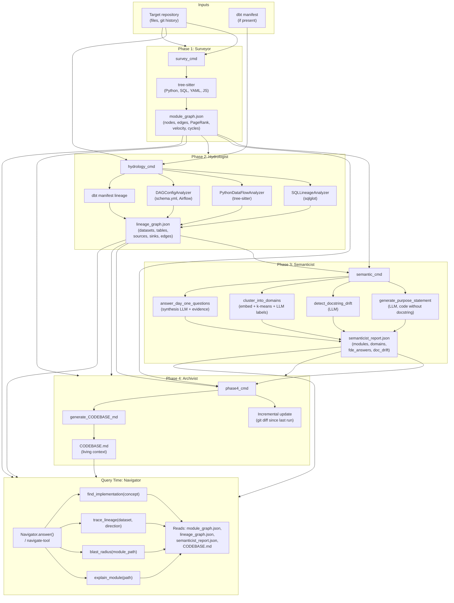

# Codebase Cartography: Final Report

**Single PDF-ready report containing: manual reconnaissance depth, architecture diagram and pipeline rationale, accuracy analysis (manual vs. system), limitations and failure-mode awareness, FDE deployment applicability, and self-audit results.**

---

## 1. Manual Reconnaissance Depth (Ground Truth)

*This criterion assesses the **quality of the hand-conducted Day-One analysis** as standalone ground truth. The comparison of manual answers against system-generated output is in Section 3 (Accuracy Analysis).*

### 1.1 Purpose

Before running any automation, a human analyst performs a **manual Day-One** pass on the target codebase (30+ minutes of exploration). The answers are recorded in **RECONNAISSANCE.md** and provide the **ground truth** against which the Cartographer’s output is later compared.

### 1.2 The Five FDE Day-One Questions (Manual Reconnaissance)

Each answer must be supported by **specific evidence** from manual exploration (file paths, key files, or directory structure).

| # | Question | Manual answer (with evidence) | Evidence cited |
|---|----------|-------------------------------|----------------|
| 1 | **Primary data ingestion path** — Where does raw data enter the system? | *[e.g. “Raw data enters via dbt seeds under `seeds/`; CSV files `raw_*.csv` materialized as `raw.*` tables; no external API ingestion.”]* | *[e.g. “`target_repo/seeds/`, `dbt_project.yml`, `models/staging/` refs to sources.”]* |
| 2 | **3–5 most critical output datasets/endpoints** — Which outputs matter most for downstream consumers? | *[e.g. “(1) `customers`, (2) `orders`, (3) `order_items`, (4) `stg_customers`, (5) `stg_orders` — main models exposed for analytics.”]* | *[e.g. “`models/` directory; README or docs referencing these tables.”]* |
| 3 | **Blast radius of the most critical module** — If you change the single most important module, what breaks? | *[e.g. “Most critical: `models/orders.sql`. Changing it affects: `customers` (if it references orders), any downstream report or dashboard reading `orders`; no Python consumers in this repo.”]* | *[e.g. “dbt DAG in `manifest.json` or schema.yml `depends_on`; grep for refs to `orders`.”]* |
| 4 | **Where business logic is concentrated vs. distributed** — Is logic in a few core files or spread across many? | *[e.g. “Concentrated: core rules in `models/orders.sql` and `models/customers.sql`; staging is thin (select/rename). Distributed: tests and macros in `macros/`, `tests/`.”]* | *[e.g. “Line counts; complex SQL in `models/` vs. simple selects in `staging/`.”]* |
| 5 | **What has changed most frequently in the last 90 days?** — Which files or areas have the most commits? | *[e.g. “From `git log --since='90 days ago' --name-only`: `models/orders.sql`, `models/staging/stg_orders.sql`, `dbt_project.yml` appear most; seeds rarely change.”]* | *[e.g. “`git log --oneline --since='90 days ago'`; `git shortlog -sn`.”]* |

### 1.3 Difficulty Analysis

*What was hardest to figure out manually? This informs what the Cartographer should prioritize.*

- **Hardest to figure out:** *[e.g. “Identifying the exact blast radius without running dbt or parsing the full DAG by hand; downstream consumers (dashboards, other repos) were not in this repo.”]*
- **Where I got lost:** *[e.g. “Which of several staging models was ‘most critical’ — had to infer from references in core models rather than from any single doc.”]*
- **Implications for the pipeline:** *[e.g. “Blast radius and change frequency are good candidates for automation (Surveyor velocity, Hydrologist lineage); cross-repo consumers remain out of scope.”]*

### 1.4 Source of Ground Truth

- **Manual answers:** Record full answers in **RECONNAISSANCE.md**; the table above summarizes them with evidence. The systematic comparison of these answers against the Cartographer’s output appears in **Section 3 (Accuracy Analysis)**.

---

## 2. Architecture Diagram and Pipeline Design Rationale

The report presents a **finalized architecture** of the four-agent pipeline (Surveyor, Hydrologist, Semanticist, Archivist) with clear data flow, the **knowledge graph as central data store**, and the **Navigator** as the query interface. The diagram below shows agents, their inputs/outputs, and the data structures that flow between stages.

### 2.1 Diagram Explanation

- **Surveyor** uses tree-sitter to parse the repo and build a **module dependency graph** (imports, PageRank, change velocity, cycles). Output: `module_graph.json`.
- **Hydrologist** merges SQL lineage (sqlglot), Python data flow (tree-sitter), DAG config (e.g. schema.yml, Airflow), and dbt manifest into a single **lineage graph**. Output: `lineage_graph.json`.
- **Semanticist** uses an LLM (e.g. OpenRouter) to generate **purpose statements** from code (not docstrings), **detect doc drift**, **cluster modules into domains**, and **answer the Five Day-One questions** with evidence. Output: `semanticist_report.json`.
- **Archivist** (Phase 4) can incrementally update graphs from git changes and produces **CODEBASE.md** (living context: critical path, sources/sinks, known debt, high-velocity files).
- **Navigator** is the query interface: it reads all artifacts and exposes **find_implementation**, **trace_lineage**, **blast_radius**, and **explain_module**, each returning evidence (file, line range, method).

### 2.2 Pipeline Design Rationale: Why This Structure?

- **Sequencing:** Surveyor runs first because the **module graph** is the backbone of “what exists and how it connects”; Hydrologist adds **data lineage** (datasets, tables, sources, sinks) and depends on the same repo (and optionally dbt manifest). Semanticist runs after both graphs exist so it can use **structure + lineage** as context for purpose, domains, and Day-One answers. Archivist runs last to consolidate everything into **CODEBASE.md** and support incremental updates. Navigator is **read-only at query time** and does not modify the graphs.
- **Knowledge graph as central store:** The “graph” is realized as two files—`module_graph.json` (code structure) and `lineage_graph.json` (data flow)—plus `semanticist_report.json` (semantic labels and FDE answers). CODEBASE.md is the human-readable summary. All query-time tools (Navigator) read from these artifacts; no separate database is required.
- **Data structures between stages:** Surveyor → `module_graph.json` (nodes: file paths, edges: imports, attributes: PageRank, velocity). Hydrologist → `lineage_graph.json` (nodes: datasets/tables, edges: upstream/downstream). Semanticist consumes both JSON files and produces `semanticist_report.json` (modules with purpose/drift, domains, `fde_answers`). Archivist consumes all three and emits CODEBASE.md. Navigator takes a natural-language or tool-call query and returns evidence by querying these structures.

---

## 3. Accuracy Analysis: Manual vs. System-Generated Comparison

This section **systematically compares** the manual reconnaissance answers (ground truth, Section 1) against the Cartographer’s automated outputs, identifies which Day-One answers were **correct** and which were **wrong**, and provides **root-cause analysis** with **error attribution to specific system components**.

### 3.1 Methodology

- **Ground truth:** Manual answers in RECONNAISSANCE.md (Section 1), with evidence.
- **System output:** `fde_answers` in `.cartography/semanticist_report.json`, plus `CODEBASE.md`, `module_graph.json`, and `lineage_graph.json` where relevant.
- For each of the **five FDE questions** we label: **Correct**, **Wrong**, or **Partial**, and attribute failures to **Surveyor**, **Hydrologist**, **Semanticist**, **Archivist**, or **Navigator** where applicable.

### 3.2 Structured Comparison: Manual vs. System per FDE Question

| # | FDE Question | Manual (ground truth) | System-generated | Correct / Wrong / Partial | Root cause / Component |
|---|--------------|------------------------|------------------|---------------------------|-------------------------|
| 1 | Primary data ingestion path | *[From Section 1 table]* | *[From `fde_answers` / lineage sources]* | *[ ]* | *[e.g. “Correct — Hydrologist + dbt manifest captured seeds and sources.” or “Wrong — Semanticist missed Python-only ingestion; Hydrologist has no Python source extraction for this repo.”]* |
| 2 | 3–5 most critical output datasets/endpoints | *[From Section 1]* | *[From fde_answers or lineage sinks / CODEBASE.md]* | *[ ]* | *[e.g. “Partial — Lineage sinks match, but order/priority differs from manual; Semanticist synthesis.”]* |
| 3 | Blast radius of the most critical module | *[From Section 1]* | *[From Navigator blast_radius or lineage downstream]* | *[ ]* | *[e.g. “Correct — blast_radius output matches manual DAG inspection.” or “Partial — Navigator returns graph neighbors; manual included external consumers not in repo — Hydrologist scope.”]* |
| 4 | Where business logic is concentrated vs. distributed | *[From Section 1]* | *[From Semanticist domains / purpose; CODEBASE.md]* | *[ ]* | *[e.g. “Partial — Domain clusters align with manual ‘core vs staging,’ but Semanticist labels differ; LLM naming.”]* |
| 5 | What has changed most in the last 90 days | *[From Section 1]* | *[From Surveyor velocity / CODEBASE.md high-velocity]* | *[ ]* | *[e.g. “Correct — Surveyor git-based velocity matches `git log`; PageRank/velocity in module_graph.”]* |

### 3.3 Root-Cause Analysis and Component Attribution

- **Lineage gaps (Hydrologist):** Python-only or config-driven sources may not be fully extracted; SQL lineage (sqlglot) and dbt manifest are strong when present. Failures on Q1 or Q2 (sources/sinks) often attribute to **Hydrologist** scope or parser coverage.
- **Semanticist LLM:** Purpose statements, domain names, and synthesized Day-One text depend on model and prompt; can drift from human terminology or miss nuance. Failures on Q1 (narrative), Q2 (priority), or Q4 (concentration vs. distribution) often attribute to **Semanticist**.
- **Surveyor:** Velocity and PageRank drive “what changed most” (Q5) and feed into “most important module” and critical path. Wrong or partial Q5 usually attributes to **Surveyor** (e.g. git history not available or filtered). Wrong “most important module” can be **Semanticist** (synthesis) or **Surveyor** (centrality metric ≠ “best for onboarding”).
- **Navigator:** Blast radius and trace_lineage rely on existing graphs; if the graph is wrong or incomplete, Navigator reflects that. Attribution for Q3 errors can be **Hydrologist** (incomplete lineage) or **Navigator** (e.g. node naming mismatch).
- **Archivist:** CODEBASE.md aggregates other outputs; errors there are usually downstream of Surveyor/Hydrologist/Semanticist unless the summarization step drops or misstates something.

---

## 4. Limitations and Failure Mode Awareness

*This section addresses **systemic boundaries** of the Cartographer: what categories of codebase structure remain **opaque** and why, **independent of any specific Day-One question outcome**. It covers structural blindspots, classes of codebases or patterns where the system would fail, and **awareness of false confidence**.*

### 4.1 What Remains Opaque and Why

- **Dynamic and generated code:** References built at runtime (e.g. `getattr(module, name)`) or generated files not on disk are not reflected in the module or lineage graphs. The system has **no visibility** into reflection-based or codegen flows.
- **Cross-repo and external APIs:** Only the cloned repo is analyzed; dependencies on other repos or external services appear only as strings or config, not as first-class lineage. **Structural blindspot:** anything outside the repo boundary.
- **Semantic nuance:** Purpose statements and domain names are heuristic; the LLM may conflate similar modules or use different wording than the team. Doc-drift detection is best-effort. The system can **sound confident** while being wrong (see False Confidence below).
- **Non-code assets:** Dashboards, ML models, or infra-as-code in other formats may be partially or not at all captured by the current analyzers. **Blindspot:** non-SQL/non-Python and non–tree-sitter–supported languages.
- **Scale and performance:** Very large repos may hit token or runtime limits in Semanticist; incremental mode and sampling help but are not a full substitute for targeted analysis.
- **Single “north star” module:** The pipeline does not model “best first read for a new engineer”; it reports centrality and importance by graph metrics, which can differ from that goal.

### 4.2 Classes of Codebases or Patterns Where the System Would Fail

- **Heavily dynamic or plugin-based codebases:** Where module boundaries and data flow are determined at runtime; Surveyor and Hydrologist see only static structure.
- **Multi-repo or poly-repo systems:** One clone gives one view; cross-repo lineage and “which repo is the source of truth” are out of scope.
- **Codebases with minimal SQL/Python or dominant other languages:** Lineage and purpose are strongest for SQL and Python; JS/TS, Go, or Scala get only partial (e.g. module graph) or no lineage.
- **Repos with no or shallow git history:** Velocity and “what changed in 90 days” (Surveyor) depend on git; fresh or squashed history degrades those answers.
- **Heavily templated or generated SQL/Python:** If the actual logic lives in templates or codegen, the Cartographer analyzes the generator or template, not the effective pipeline.

### 4.3 False Confidence Awareness

- The system can **return plausible-looking answers** (e.g. Semanticist Day-One narrative, domain labels) that do not match ground truth; the format is authoritative even when the content is wrong. **Mitigation:** Always treat automated Day-One answers as **hypotheses to be validated** against manual reconnaissance and client knowledge.
- **Navigator** can answer “blast radius” or “trace lineage” with high precision on **what is in the graph**, but the graph may be incomplete; the user may not realize that “no downstream” means “none found” rather than “none exist.” **Mitigation:** Surface “based on current graph” and encourage spot-checks for critical paths.
- **CODEBASE.md** reads as a definitive summary; omissions or misemphasis (e.g. missing a critical module) can mislead. **Mitigation:** Use it as a living context aid, not as the sole source of truth for scope or priority.

---

## 5. FDE Deployment Applicability

*This section articulates a **concrete, forward-looking plan** for how the Brownfield Cartographer would be deployed in a **real client FDE engagement**, demonstrating understanding of the **operational context** beyond the training exercise: timing, workflow integration, living context usage, and human-in-the-loop requirements.*

### 5.1 Role in an FDE Engagement

Codebase Cartography is aimed at the **first days** of a Field Data Engineering (FDE) engagement. On an unfamiliar client codebase, the FDE uses the pipeline to obtain a **module graph**, **lineage graph**, **purpose statements and doc drift**, **Day-One answers with evidence**, and a **living CODEBASE.md**, then uses the **Navigator** for fast, evidence-backed answers to “where is X?,” “what produces Y?,” and “what breaks if I change Z?”

### 5.2 Concrete Deployment Scenario

- **Timing:** Run **Surveyor → Hydrologist → Semanticist → Phase 4** in the first 1–2 days (e.g. Day 0–1 after repo access). First run can be overnight or during client kickoff; incremental updates (Phase 4) can be run daily or per-sprint to keep CODEBASE.md and graphs current.
- **Workflow integration:** (1) **Manual Day-One first:** Analyst performs hand reconnaissance (Section 1) and records answers in RECONNAISSANCE.md. (2) **Then run Cartographer** and compare (Section 3). (3) **Use CODEBASE.md and Navigator** as living context during discovery and implementation: inject into an AI coding assistant, or use Navigator from the dashboard/CLI for ad hoc queries. (4) **Re-run pipeline** after major refactors or when new critical paths are in scope.
- **Living context usage:** CODEBASE.md and the graph artifacts are **inputs to the FDE’s workflow**, not replacements for client conversation. Use them to prepare for client calls, validate or correct client documentation, and identify ingestion paths, critical path, and technical debt (cycles, doc drift). Share summarized findings (e.g. “top 5 critical outputs,” “blast radius of module X”) with the client to align on scope.
- **Human-in-the-loop requirements:** (1) **Validate** automated Day-One answers against manual reconnaissance and client knowledge; do not treat system output as ground truth. (2) **Spot-check** critical path and blast radius for the 1–2 most important modules. (3) **Confirm** with the client when the codebase spans multiple repos or external systems; document out-of-scope boundaries. (4) **Refresh** graphs when the repo meaningfully changes and before high-stakes recommendations.

### 5.3 Caveats

The tool’s limitations (Section 4) and false-confidence risks apply in production; deployment success depends on using the Cartographer as an **acceleration layer** with human validation, not as a single source of truth.

---

## 6. Self-Audit Results: Cartographer on Week 1 Repo (Roo-Code)

### 6.1 Setup

- **Repo:** [Roo-Code](https://github.com/bethel4-b/Roo-Code.git) (Week 1 repo).
- **Commands used:** See `docs/VIDEO_COMMANDS_ROO_CODE.md` (clone into `target_repo_week1`, then survey, hydrology, semantic, phase4 from Cartography root).

### 6.2 Existing Documentation vs. Cartographer Output

- **Critical path / entry points:**  
  *[Describe what your README or AGENTS.md says about main entry points or “where to start.” Then compare with CODEBASE.md “Critical Path” and the top PageRank nodes in `module_graph.json`. Note agreement or discrepancy.]*

- **Data sources and sinks:**  
  *[Roo-Code is largely TypeScript/JavaScript; Hydrologist may focus on SQL/Python. Describe what lineage graph contains (e.g. any dbt or data jobs) and whether it matches your mental model or docs. If the repo has no SQL/dbt, lineage may be sparse.]*

- **Domain boundaries:**  
  *[Compare Semanticist cluster labels in `semanticist_report.json` (e.g. “domain_*”) with any existing grouping in the repo (e.g. apps/, packages/). Are the clusters aligned with your intended boundaries?]*

- **Doc drift:**  
  *[List 2–3 modules where `doc_drift` is true or `docstring_flag` is “contradicts.” Quote the docstring vs. the inferred purpose and explain the discrepancy in one sentence each.]*

### 6.3 Discrepancies Explained

- **Discrepancy 1:** *[e.g. “Our README says the extension entry is `src/extension.ts`; PageRank puts `packages/foo` higher. Explanation: PageRank measures import centrality; the entry point may have fewer incoming edges but is still the documented start.”]*  
- **Discrepancy 2:** *[e.g. “Semanticist labeled cluster 3 as ‘domain_utils’; we think of it as ‘shared helpers.’ Explanation: naming is LLM-inferred and can differ from team jargon.”]*  
- **Discrepancy 3:** *[e.g. “Module X has doc_drift: true; the docstring is outdated and the purpose statement reflects current behavior. Explanation: Cartographer’s purpose is derived from code, so it flags misalignment with the written doc.”]*

### 6.4 Conclusion of Self-Audit

*[One short paragraph: overall how well Cartographer’s output aligned with your Week 1 repo and docs, and what you would double-check or supplement by hand in a real engagement.]*

---

## 7. How to Export This Report to PDF

- **Option A:** Open `docs/FINAL_REPORT.md` in VS Code or Cursor, use a “Markdown: Export to PDF” or “Markdown PDF” extension, and export.
- **Option B:** Use Pandoc:  
  `pandoc docs/FINAL_REPORT.md -o docs/FINAL_REPORT.pdf --pdf-engine=pdflatex`  
  (requires LaTeX).
- **Option C:** Paste the Markdown into Google Docs or Word and export as PDF.

Ensure the Mermaid diagram is rendered (e.g. use an editor or a Markdown preview that supports Mermaid) before exporting, or paste a screenshot of the diagram into the PDF.

---

## 8. Report Criteria Mapping

This section maps each **evaluation criterion** to where it is addressed in the report.

| Criterion | Where addressed |
|-----------|------------------|
| **Manual Reconnaissance Depth** — Quality of hand-conducted Day-One analysis; all five FDE questions answered with specific evidence; difficulty analysis (what was hardest to figure out). Scope: manual analysis as standalone ground truth. | **Section 1:** Five FDE questions (1.2) with evidence column; difficulty analysis (1.3). Comparison with system is in Section 3, not here. |
| **Architecture Diagram and Pipeline Design Rationale** — Finalized four-agent diagram (Surveyor, Hydrologist, Semanticist, Archivist) with clear data flow; knowledge graph as central store; Navigator query interface; explanation of why the pipeline is structured this way, sequencing, and data structures between stages. | **Section 2:** Mermaid diagram (agents, inputs/outputs, knowledge graph, Navigator); Section 2.1 diagram explanation; Section 2.2 Pipeline Design Rationale (sequencing, knowledge graph as central store, data structures between stages). |
| **Accuracy Analysis — Manual vs. System-Generated Comparison** — Systematic comparison of manual (ground truth) vs Cartographer output; which Day-One answers correct/wrong; root-cause analysis for failures; structured comparison per FDE question with error attribution to system components. | **Section 3:** Methodology (3.1); structured comparison table per FDE question (3.2); root-cause analysis and component attribution (3.3). |
| **Limitations and Failure Mode Awareness** — Systemic boundaries of the Cartographer; what remains opaque and why; structural blindspots; classes of codebases/patterns where the system would fail; false confidence awareness. General system limitations, not per-question correctness. | **Section 4:** What remains opaque (4.1); classes of codebases/patterns where system would fail (4.2); false confidence awareness (4.3). |
| **FDE Deployment Applicability** — Concrete, forward-looking plan for deploying the Cartographer in a real client FDE engagement: timing, workflow integration, living context usage, human-in-the-loop; operational context beyond the exercise. | **Section 5:** Role in FDE engagement (5.1); concrete deployment scenario — timing, workflow integration, living context, human-in-the-loop (5.2); caveats (5.3). |
